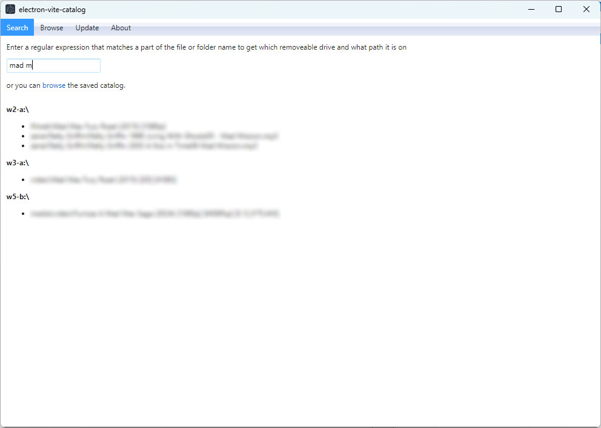
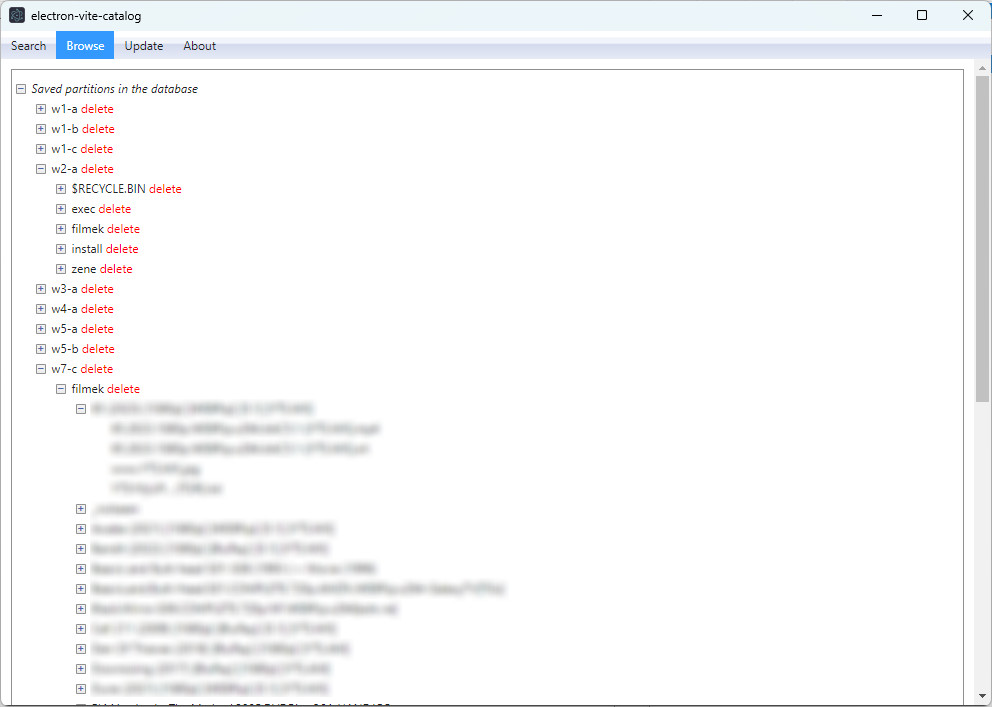
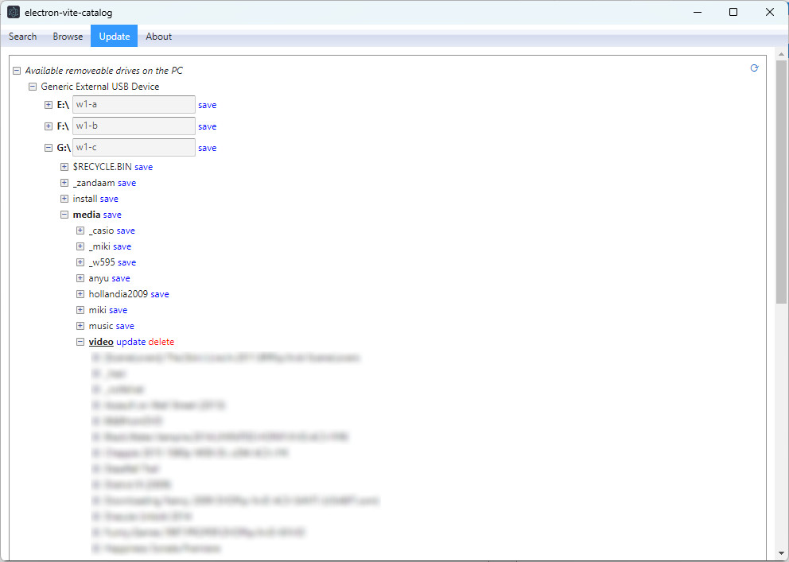

# electron-vite-catalog

A sophisticated desktop file cataloging application for managing and searching removable storage devices. Built with modern web technologies to deliver a fast, type-safe desktop experience.

## Overview

**electron-vite-catalog** is a cross-platform desktop application that enables users to maintain a persistent catalog of files and folders across removable storage devices (USB drives, external hard drives, etc.). The application provides intelligent search capabilities, hierarchical browse functionality, and automatic device scanning.

### Key Features

- **Multi-Device Support**: Scan and catalog files from multiple removable storage devices simultaneously
- **Full-Text Search**: Fast, case-insensitive search across all cataloged files and directories
- **Persistent Database**: Stores metadata in a local JSON database in the application's data directory
- **Hierarchical Navigation**: Intuitive tree view for browsing catalog structure
- **Device Management**: Automatic detection and listing of connected removable drives and partitions
- **Partition Labeling**: Custom labels for storage partitions with persistent metadata storage
- **Cross-Platform**: Native builds for Windows, macOS, and Linux

### Technology Stack

- **[Electron 31+](https://www.electronjs.org/)**: Cross-platform desktop application framework
- **[Electron Vite](https://electron-vite.org/)**: Next-generation build tool for Electron apps with HMR support
- **[Svelte 4](https://svelte.dev/)**: Reactive, compiler-based UI framework
- **[TypeScript 5](https://www.typescriptlang.org/)**: Type-safe development experience
- **[Vite 5](https://vitejs.dev/)**: Lightning-fast build tool with native ES modules support
- **[drivelist](https://www.npmjs.com/package/drivelist)**: Cross-platform removable drive detection

## Architecture

### Project Structure

```
src/
├── main/                    # Electron main process
│   ├── api.ts              # IPC handlers & file system operations
│   ├── fs-utils.ts         # Partition detection & labeling utilities
│   └── index.ts            # Application entry point
├── preload/                # Preload script (sandbox context)
│   ├── index.ts            # IPC bridge definition
│   └── preload.d.ts        # TypeScript definitions
├── renderer/               # Electron renderer process (UI)
│   ├── index.html          # Application entry HTML
│   └── src/
│       ├── App.svelte      # Root component
│       ├── main.ts         # Renderer entry point
│       ├── components/     # UI components
│       │   ├── Browse.svelte        # Directory tree browser
│       │   ├── Search.svelte        # Full-text search interface
│       │   ├── AvailableDrives.svelte  # Device scanning & update
│       │   ├── TreeView.svelte      # Reusable tree component
│       │   ├── Navigation.svelte    # Tab navigation system
│       │   └── ...
│       └── stores/         # Svelte reactive stores
│           ├── database.ts        # Catalog state management
│           ├── progress.ts        # Update progress tracking
│           └── ...
└── common/                 # Shared types & utilities
    ├── types.ts            # TypeScript type definitions
    └── utils.ts            # Shared utility functions
```

### IPC Communication

The application uses Electron's IPC mechanism for secure communication between main and renderer processes:

| Handler | Parameters | Returns | Purpose |
|---------|-----------|---------|---------|
| `getDirectoryStructure` | `dirPath?: string, maxDepth?: number` | `FsEntry[]` | Fetch hierarchical directory tree |
| `readDb` | — | `Database` | Read entire catalog from disk |
| `writeDb` | `database: Database` | `void \| Error` | Persist catalog to disk |
| `getDbPath` | — | `Promise<string>` | Get database file path |

### Data Model

```typescript
// File system entry in the catalog
type FsEntry = {
  type: FsEntryType;        // 'file' | 'folder' | 'partition' | 'drive'
  label: string;            // Display name
  fullPath: string;         // Absolute file system path
  children?: FsEntry[];     // Child entries (directories)
};

// Complete catalog
type Database = FsEntry[];  // Array of top-level partitions
```

### Database Persistence

The application maintains a JSON database at:
- **Windows**: `%APPDATA%\catalog\database.json`
- **macOS**: `~/Library/Application Support/catalog/database.json`
- **Linux**: `~/.config/catalog/database.json`

Each partition can be assigned a custom label that is persisted via a hidden metadata file (`.partition-id`) on the storage device itself, enabling label persistence across application sessions and machines.

## Development

### Prerequisites

- Node.js 18+ with npm
- Git

### Installation

```bash
npm install
```

### Development Server

Start the development environment with hot module replacement (HMR):

```bash
npm run dev
```

The application will automatically reload as you make changes to both main and renderer processes.

### Code Quality

Run linting and formatting:

```bash
# Format code with Prettier
npm run format

# Lint with ESLint (auto-fix issues)
npm run lint

# Type checking
npm run typecheck              # Check both Node & Svelte
npm run typecheck:node         # TypeScript only
npm run svelte-check           # Svelte component checking
```

### Build

Compile TypeScript and bundle the application:

```bash
npm run build
```

This runs type checking and builds optimized bundles for all platforms.

### Create Platform-Specific Distributables

```bash
# Windows installer (.exe, .msi)
npm run build:win

# macOS application (.dmg, .app)
npm run build:mac

# Linux packages (.AppImage, .deb)
npm run build:linux

# Preview build without packaging
npm run build:unpack
```

Platform-specific configurations are defined in `electron-builder.yml`.

## IDE Setup

### Recommended VSCode Extensions

- **[Svelte for VS Code](https://marketplace.visualstudio.com/items?itemName=svelte.svelte-vscode)** - Syntax highlighting, diagnostics, and IntelliSense
- **[ESLint](https://marketplace.visualstudio.com/items?itemName=dbaeumer.vscode-eslint)** - Code linting and auto-fix
- **[Prettier](https://marketplace.visualstudio.com/items?itemName=esbenp.prettier-vscode)** - Code formatting on save

### Recommended Settings (`.vscode/settings.json`)

```json
{
  "editor.formatOnSave": true,
  "[svelte]": {
    "editor.defaultFormatter": "svelte.svelte-vscode"
  },
  "[typescript]": {
    "editor.defaultFormatter": "esbenp.prettier-vscode"
  }
}
```

## Screenshots





## Project Configuration Files

- `electron.vite.config.ts` - Vite configuration for Electron build process
- `electron-builder.yml` - Distribution packaging configuration
- `tsconfig.json` - TypeScript compiler options for renderer
- `tsconfig.node.json` - TypeScript options for main/preload processes
- `svelte.config.mjs` - Svelte preprocessor configuration

## License

See LICENSE file for details.

## References

- [Electron Documentation](https://www.electronjs.org/docs)
- [Electron Vite Guide](https://electron-vite.org/guide/)
- [Svelte Documentation](https://svelte.dev/docs)
- [TypeScript Handbook](https://www.typescriptlang.org/docs/)
